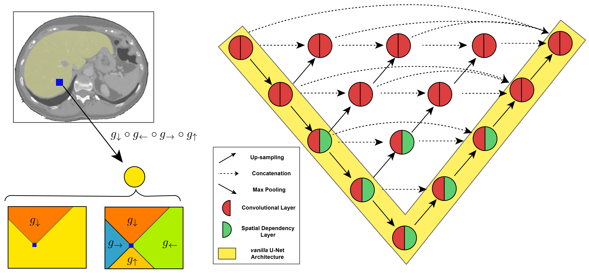

# Holistic Segmentation Using Spatial Recurrence

<div align="center">

</div>
<div align="center"> </div>

## Introducing Spatial Recurrence for Holistic Image Segmentation

For medical image segmentation to generalize, we need two components: to identify local descriptions, but at the same time to develop a **holistic** representation of the image that captures long-range spatial dependencies. Unfortunately, we demonstrate that the start of the art does not achieve the latter.

We introduce a novel deep neural network architecture endowed with spatial recurrence that achieves this. The implementation relies on gated recurrent units, and in particular on [spatial dependency layers](https://arxiv.org/abs/2103.08877),  that directionally traverse the feature map, greatly increasing each layers receptive field and explicitly modeling  non-adjacent relationships between pixel. 

This implementation is competitive with state of the art methods, surpassing multiple transformer based architectures. 

**You can find the paper that accompanies this work here:**
[Holistic Modeling in Medical Image Segmentation Using Spatial Recurrence](https://openreview.net/forum?id=avqFDNyt0Dj)

## Code Structure

```
.
├── data/
     ├── dsb2018/              # where DSB2018 data is stored
     ├── lits/                 # where LiTS data is stored
     ├── polips/               # where CVC_ClinicDB data is stored
     ├── segTHOR.py            # where SegTHOR data is stored
├── figs/                      # figures from the paper
├── lib/
     ├── core.py               # building blocks and parent LightningModule for all models
     ├── dataset.py            # Pytorch/PytorchLightning specific modules for the datasets anda dataloaders
     ├── models.py             # all architectures
     ├── sdn.py.               # SDN modules
     ├── utils.py              # utility with helper functions, loss functions and evaluation metrics
 ├── train.py                  # generic training script
 ├── requirements.txt
 ├── LICENSE
 └── README.md
```

## Reproducibility

To reproduce the experiments described in the [paper](https://openreview.net/forum?id=avqFDNyt0Dj) you will first need to install [PyTorch](pytorch.org) and [PyTorchLightning](https://github.com/PyTorchLightning/pytorch-lightning). To fully reproduce the experiments on the segTHOR dataset you will need a system equipped with a TeslaV100 GPU with 32Gb of memory, otherwise, reduce the batch size when training at a cost of segmentation performance. 

To install all the requirements use:

```bash
pip install -r requirements.txt
```

To try specific experiments run:

```python
python train.py --dataset DATASET_NAME --train True --test True --n_gpus 1 --early_stopping True --batch_size N --lr 0.0001 --block vgg --model MODEL_NAME --n_layers M --exp_name EXP_NAME
```

Replacing *DATASET_NAME*, *MODEL_NAME*, *EXPERIMENT_NAME*, *N*, and *M* approprietly for the configurations of the experiment. 

## Where to obtain the data ?

#### DSB2018

data downloaded at:
 https://www.kaggle.com/c/data-science-bowl-2018/data

*[Haghighi, M., Heng, C., Becker, T., Doan, M., McQuin, C., et al.: Nucleus Segmentation Across Imaging Experiments: The 2018 Data Science Bowl. Nature Methods 16(12), 1247–1253 (2019]*

#### CVC-ClinicDB

database description and download link available at:
 https://polyp.grand-challenge.org/CVCClinicDB/

*[Bernal, J., Tajkbaksh, N., Sánchez, F.J., Matuszewski, B.J., Chen, H., Yu, L.,Angermann, Q., Romain, O., Rustad, B., Balasingham, I., et al.: Comparative Validation of Polyp Detection Methods in Video Colonoscopy: Results From the Miccai 2015 Endoscopic Vision Challenge. IEEE Transactions on Medical Imaging 36(6), 1231–1249 (2017)]*

#### LiTS

 database description and download instructions at:
 https://competitions.codalab.org/competitions/17094

*[Bilic, P., Christ, P.F., Vorontsov, E., Chlebus, G., Chen, H., Dou, Q., Fu, C., Han,X., Heng, P., Hesser, J., Kadoury, S., Konopczynski, T.K., Le, M., Li, C., Li, X.,Lipková, J., Lowengrub, J.S., Meine, H., Moltz, J.H., Pal, C., Piraud, M., Qi, X.,Qi, J., Rempfler, M., Roth, K., Schenk, A., Sekuboyina, A., Zhou, P., Hülsemeyer,C., Beetz, M., Ettlinger, F., Grün, F., Kaissis, G., Lohöfer, F., Braren, R., Holch,J., Hofmann, F., Sommer, W.H., Heinemann, V., Jacobs, C., Mamani, G.E.H.,van Ginneken, B., Chartrand, G., Tang, A., Drozdzal, M., Ben-Cohen, A., Klang,E., Amitai, M.M., Konen, E., Greenspan, H., Moreau, J., Hostettler, A., Soler, L.,Vivanti, R., Szeskin, A., Lev-Cohain, N., Sosna, J., Joskowicz, L., Menze, B.H.: The Liver Tumor Segmentation Benchmark (LiTS). CoRRabs/1901.04056(2019)]*

#### SegTHOR

database description and download link available at:
[CodaLab - Competition](https://competitions.codalab.org/competitions/21145#learn_the_details-dataset)

*[Zoé Kanvertm Caroline Petitjean, Bernard Dubray, Su Ruan]*


